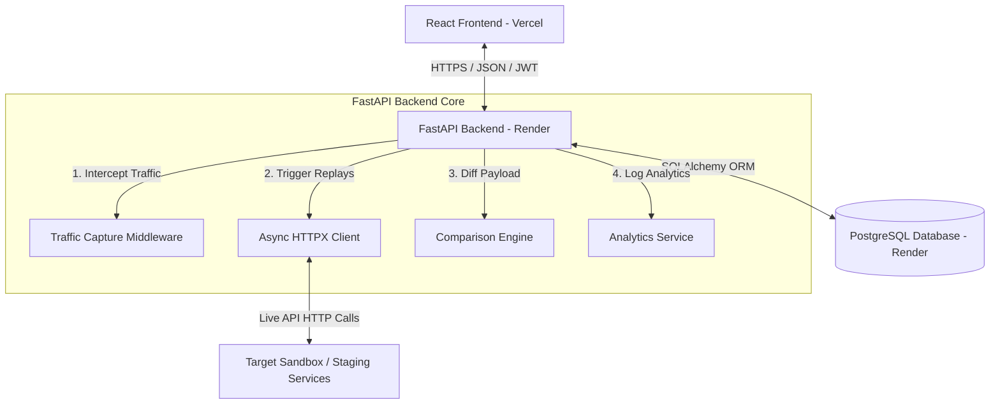
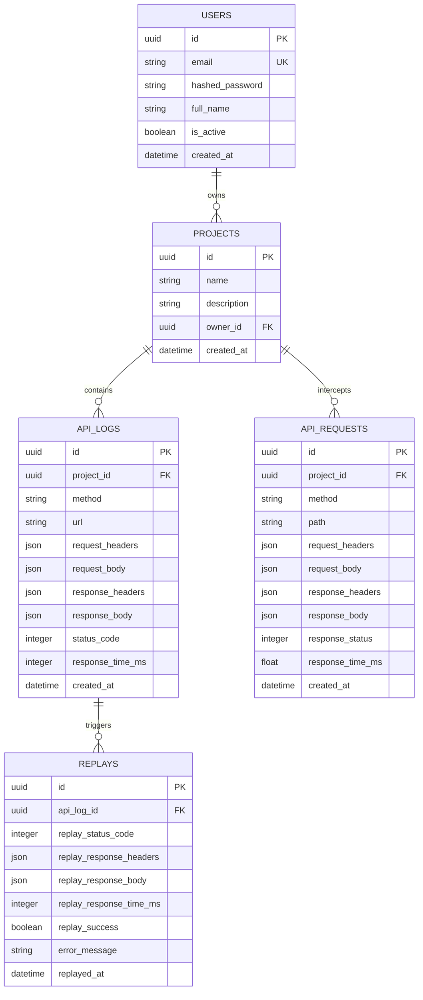

<div align="center">

# ReplayIQ 🔄
### **API Traffic Replay & Failure Analysis Platform**

[](https://python.org)
[](https://fastapi.tiangolo.com)
[](https://react.dev)
[](https://postgresql.org)
[](https://docker.com)
[](LICENSE)
[](https://replay-iq.vercel.app)
[](https://replayiq-mzsm.onrender.com)

**ReplayIQ** is a developer-centric SaaS platform designed to capture, replay, and compare API transactions. It allows QA and engineering teams to record HTTP payloads, trigger instant transaction replays against sandbox/staging services, and execute side-by-side JSON schema diff comparisons to catch regression bugs instantly.

[Live Demo Website](https://replay-iq.vercel.app) • [Swagger API Documentation](https://replayiq-mzsm.onrender.com/docs) • [Backend API Service](https://replayiq-mzsm.onrender.com)

</div>

---

## 🚀 Live Demo URLs
- 🖥️ **Production Client**: [https://replay-iq.vercel.app](https://replay-iq.vercel.app)
- ⚙️ **Production REST API**: [https://replayiq-mzsm.onrender.com](https://replayiq-mzsm.onrender.com)
- 📖 **Interactive Swagger UI**: [https://replayiq-mzsm.onrender.com/docs](https://replayiq-mzsm.onrender.com/docs)
- 🔗 **GitHub Repository**: [https://github.com/HarshEvolves/ReplayIQ](https://github.com/HarshEvolves/ReplayIQ)

---

## 📸 Screenshots

<details>
<summary><b>Click to expand interface screenshots</b></summary>

### Login Screen


### Metrics Dashboard


### Project CRUD Workspace


### API Logs Data Table


### Side-by-Side Replay Comparison


### Analytics Reports


</details>

---

## ⚡ Main Features
- 🔐 **Secure JWT Session Management**: Email registration, login, and bearer authorization token injection.
- 📁 **Workspace Projects CRUD**: Keep logs organized into isolated workspaces.
- 📝 **Dual Log Recording**: Manually upload mock log payloads or inspect automatically captured HTTP client logs.
- 🔄 **Replay Engine**: Powered by async HTTPX requests to execute live API replays with original headers and bodies.
- 🔍 **Response Comparison Engine**: Computes latency margins, HTTP status mismatches, and visual JSON body key diffs.
- 📊 **Visual Analytics**: Interactive metrics showing HTTP verb distributions, status code ranges, and slowest endpoints.
- 🚥 **Automatic Traffic Middleware**: Background interceptor to capture and associate HTTP transactions instantly.
- 🐳 **Dockerized Scaffolding**: Local setups using Docker Compose.

---

## 📐 System Architecture

ReplayIQ utilizes a modern, decoupled architecture connecting React to a modular FastAPI backend service:



---

## 🗄️ Database Schema

The entity relationships are designed around project containment and transaction tracking:



---

## 📁 Project Structure

```text
ReplayIQ/
├── app/                        # FastAPI Backend Application
│   ├── api/                    # API Route Handlers (Auth, Projects, Logs, Replay, etc.)
│   ├── core/                   # Config, Security, Exception Handlers, Logging
│   ├── db/                     # DB Connection Session Setup
│   ├── middleware/             # HTTP Traffic Capture Interceptor
│   ├── models/                 # SQLAlchemy DB Models (User, Project, Replay, etc.)
│   ├── schemas/                # Pydantic Schemas for Input Validation
│   └── services/               # Core Logic (Replays, Comparisons, Analytics)
├── frontend/                   # React JS Client Application
│   ├── public/                 # Static Assets
│   ├── src/
│   │   ├── components/         # Layout, Modals, EmptyStates
│   │   ├── context/            # AuthContext Session State
│   │   ├── pages/              # App Pages (Dashboard, Logs, Projects, Settings)
│   │   └── services/           # Reusable API Service Layers (authService, Axios)
│   └── vercel.json             # Vercel SPA Routing Configuration
├── tests/                      # Pytest Suite (Auth, Replay, Traffic, Hardening)
├── alembic/                    # DB Migrations Setup
├── docker-compose.yml          # Local Docker Compose Scaffolding
└── Dockerfile                  # Multi-stage Containerization
```

---

## 🛠️ Installation & Setup

### Prerequisites
- Python 3.13+
- Node.js 18+ & npm
- PostgreSQL (or run via Docker)
- Docker & Docker Compose (Optional)

---

### Local Development Setup

#### 1. Clone the repository
```bash
git clone https://github.com/HarshEvolves/ReplayIQ.git
cd ReplayIQ
```

#### 2. Backend Setup
1. Create a Python virtual environment and activate it:
   ```bash
   python3 -m venv venv
   source venv/bin/activate
   ```
2. Install package dependencies:
   ```bash
   pip install -r requirements.txt
   ```
3. Set up environment variables. Copy `.env.example` to `.env` and configure credentials:
   ```bash
   cp .env.example .env
   ```
4. Run migrations using Alembic:
   ```bash
   alembic upgrade head
   ```
5. Launch the local development server:
   ```bash
   uvicorn app.main:app --reload
   ```
   The backend API will run on [http://localhost:8000](http://localhost:8000).

#### 3. Frontend Setup
1. Navigate to the frontend directory:
   ```bash
   cd frontend
   ```
2. Install package dependencies:
   ```bash
   npm install
   ```
3. Copy local environment overrides and launch:
   ```bash
   npm run dev
   ```
   The frontend UI will run on [http://localhost:3000](http://localhost:3000) and proxy `/api` calls.

---

### Docker Scaffolding Setup

Run the entire stack locally with one command:
```bash
docker compose up --build
```
This boots:
- **PostgreSQL Database** running on port `5432`
- **FastAPI Web Service** running on port `8000`

---

## 🔒 Environment Variables

### Backend Environment Configuration (`.env`)
| Variable | Default Value | Description |
| :--- | :--- | :--- |
| `POSTGRES_SERVER` | `localhost` | Database host name / domain |
| `POSTGRES_USER` | `postgres` | Database username |
| `POSTGRES_PASSWORD` | `postgres` | Database credentials |
| `POSTGRES_DB` | `replayiq` | PostgreSQL database name |
| `POSTGRES_PORT` | `5432` | Database port number |
| `SECRET_KEY` | *(Generate Random)* | Secret key for signing JWT tokens |
| `ALGORITHM` | `HS256` | Cryptographic algorithm for JWTs |
| `ACCESS_TOKEN_EXPIRE_MINUTES` | `60` | JWT expiration duration in minutes |

### Frontend Environment Configuration (`frontend/.env.production`)
| Variable | Value | Description |
| :--- | :--- | :--- |
| `VITE_API_URL` | `https://replayiq-mzsm.onrender.com` | Deployed production backend base URL |

---

## 📞 API Overview

Major REST API routes exposed on the backend service under `/api/v1`:

| Category | Method | Path | Description |
| :--- | :--- | :--- | :--- |
| **Auth** | `POST` | `/auth/register` | Register a new user account |
| **Auth** | `POST` | `/auth/login` | Authenticate and retrieve JWT token |
| **Users** | `GET` | `/users/me` | Fetch active user credentials |
| **Projects** | `GET` | `/projects` | Get projects list |
| **Projects** | `POST` | `/projects` | Create a new project workspace |
| **Logs** | `GET` | `/projects/{pid}/logs` | Fetch paginated mock logs |
| **Logs** | `POST` | `/projects/{pid}/logs` | Store a mock request payload |
| **Replays** | `POST` | `/projects/{pid}/logs/{lid}/replay` | Trigger async request replay |
| **Comparison**| `GET` | `/projects/{pid}/logs/{lid}/replays/{rid}/comparison` | Compare response payloads |
| **Analytics** | `GET` | `/projects/{pid}/analytics/summary` | Fetch dashboard metrics summary |

---

## 🧪 Testing

The repository contains an automated Pytest suite covereing route security, validation, error responses, and exception formatting.

Execute tests using this command in the root folder:
```bash
pytest
```
*Note: Make sure your `venv` is active and dependencies are loaded.*

---

## 🌐 Production Deployment

### Backend (Render)
1. Set up a Web Service on Render linked to your repository.
2. Select environment **Docker**.
3. Set the following environment variables:
   - `POSTGRES_SERVER`, `POSTGRES_USER`, `POSTGRES_PASSWORD`, `POSTGRES_DB`, `POSTGRES_PORT` (Pointing to your Render Postgres instance)
   - `SECRET_KEY`, `ALGORITHM`
4. Deploy the service. Port bindings are handled dynamically.

### Frontend (Vercel)
1. Import the repository on Vercel.
2. Configure **Root Directory** as `frontend`.
3. Set Build settings:
   - **Framework Preset**: `Vite`
   - **Build Command**: `npm run build`
   - **Output Directory**: `dist`
4. Set Environment Variables:
   - `VITE_API_URL`: `https://your-backend-render-url.com`
5. Click **Deploy**. SPA routing redirections will be loaded from `vercel.json` automatically.

---

## 🔮 Future Improvements
- 👥 **Team Collaborations**: Invite organization members to share workspaces and logs.
- 🔌 **WebSockets integration**: Real-time push updates for running transaction lists.
- 🛑 **Rate Limiting**: Defend endpoints from payload overload.
- 📅 **Cron Scheduled Replays**: Schedule recurring API regression test cycles.
- 📦 **API Collection Imports**: Support importing requests from Postman or OpenAPI specifications.
- 🔔 **Alerting Notifications**: Hook failure comparisons to Slack, Discord, or Email notifications.

---

## 🤝 Contributing
Contributions are welcome! Please follow these guidelines:
1. Fork the repository.
2. Create your feature branch (`git checkout -b feature/NewFeature`).
3. Commit your changes (`git commit -m 'Add NewFeature'`).
4. Push to the branch (`git push origin feature/NewFeature`).
5. Open a Pull Request.

---

## 📄 License
Distributed under the MIT License. See [LICENSE](LICENSE) for more information.
